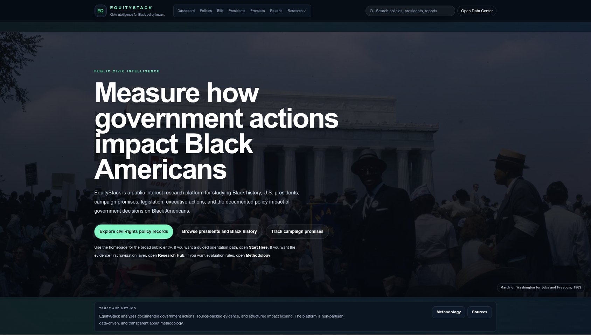
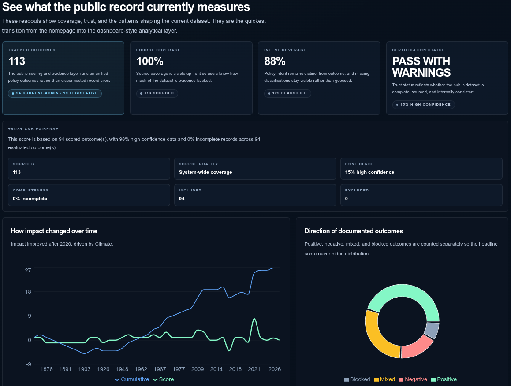
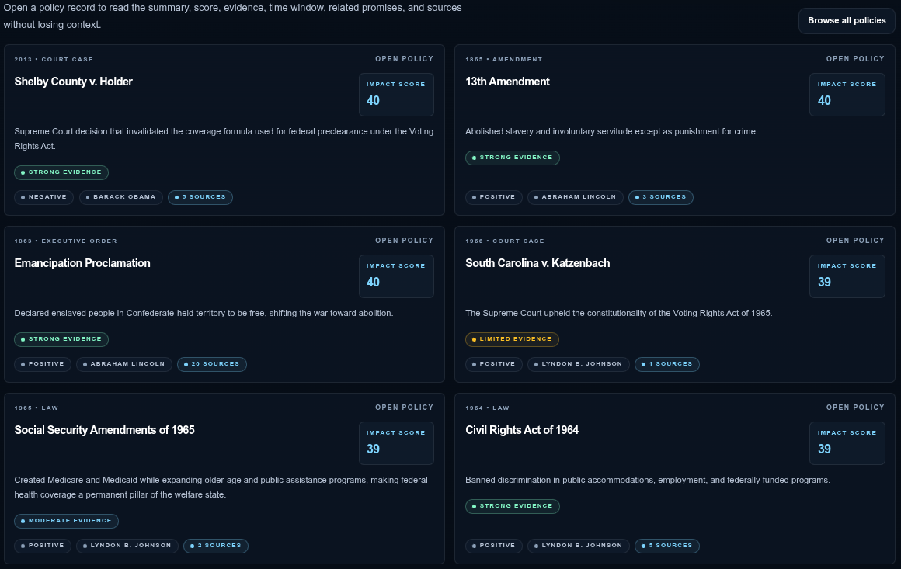
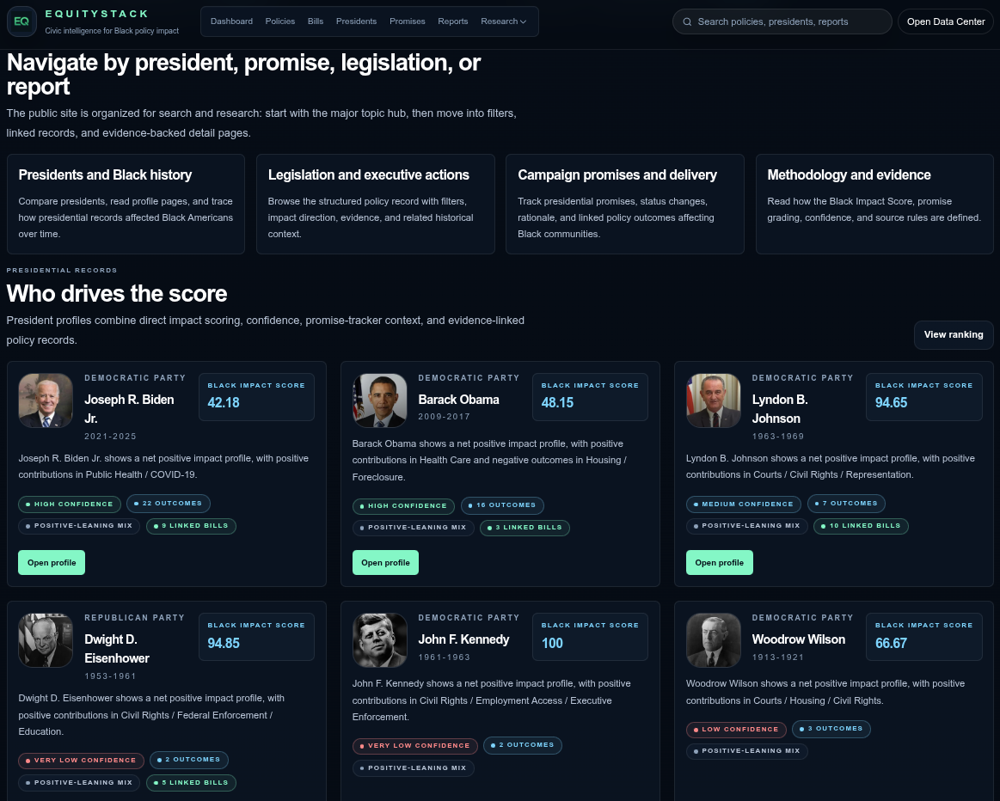

# EquityStack

**A public-interest civic data platform for tracking policy promises, presidential records, and measurable Black community impact.**

EquityStack helps users explore how policy decisions, campaign promises, legislation, and presidential actions connect to outcomes affecting Black Americans.

EquityStack exists to make civic accountability measurable, inspectable, and grounded in evidence instead of narratives.

🌐 **Live Site:** [https://equitystack.org](https://equitystack.org)


---

## Screenshots

| | |
|---|---|
|  |  |
|  |  |

---

## What EquityStack Does

EquityStack is designed to make civic accountability easier to understand by connecting:

- Presidential promises
- Public policy records
- Legislative actions
- Source-backed evidence
- Black impact scoring
- Promise fulfillment tracking
- Historical and modern policy context

The goal is not to tell users what to think, but to make the record easier to inspect.

---

## Key Features

- President-by-president policy and promise profiles
- Black Impact Score methodology
- Promise Tracker for campaign commitment outcomes
- Policy Explorer with source-backed records
- Legislative and budget impact tracking
- Research hub, explainers, and public methodology pages
- Searchable civic accountability data
- Responsive public-facing UI built for readability

---

## Tech Stack

- Next.js App Router
- React
- Tailwind CSS
- JavaScript
- Node.js
- MySQL / MariaDB
- PM2 deployment
- Cloudflare Tunnel / reverse proxy friendly

---

## Getting Started

```bash
git clone <repo-url>
cd equitystack
npm install
npm run dev
```

Create a local environment file:

```bash
cp .env.example .env.local
```

Then update the database, API, and admin authentication settings as needed. The app expects local environment variables in `.env.local`, including database connection settings and the admin basic-auth credentials used by [`proxy.js`](proxy.js).

Run the development server:

```bash
npm run dev
```

Visit:

```text
http://localhost:3000
```

Useful commands:

```bash
npm run dev
npm run build
npm run start
npm run lint
```

---

## Project Status

EquityStack is actively being developed. Current priorities include improving civic data coverage, expanding source-backed analysis, refining Black Impact Score visibility, and making the Promise Tracker easier to understand at a glance.

---

## Why This Matters

Public policy discussions are often driven by narratives, not traceable data.

EquityStack connects promises, policy, and outcomes into a system that can be inspected, challenged, and improved over time.

---

## Project Structure

This repository has two active parts:

- The Node.js / Next.js website at the repo root
- The Python data pipeline in [`python/`](python/)

Key directories:

- [`app/`](app/) for routes, pages, and UI
- [`lib/`](lib/) for data access and shared services
- [`public/`](public/) for website assets
- [`database/`](database/) for schema and SQL helpers
- [`docs/`](docs/) for architecture, workflow, and operator documentation

The current database source of truth is [`database/equitystack.sql`](database/equitystack.sql). Active pipeline outputs live under [`python/reports/`](python/reports/).

---

## Public Routes

- [`/`](app/page.js) for the public homepage and flagship entry points
- [`/policies`](app/policies/page.js) for policy records
- [`/promises`](app/promises/page.js) for promise records, outcomes, and delivery status
- [`/compare/policies`](app/compare/policies/page.js) for side-by-side policy comparison
- [`/how-it-works`](app/how-it-works/page.js) for the reader-facing methodology guide
- [`/start`](app/start/page.js) for onboarding and guided explainers
- [`/reports`](app/reports/page.js) for curated report entry points
- [`/reports/black-impact-score`](app/reports/black-impact-score/page.js) for the Black Impact Score system
- [`/research/how-black-impact-score-works`](app/research/how-black-impact-score-works/page.js) for the public scoring-methodology explainer
- [`/reports/civil-rights-timeline`](app/reports/civil-rights-timeline/page.js) for the curated civil-rights timeline

---

## Product Model

EquityStack treats public record pages as the core product, not as thin wrappers around reports.

Policy pages can include Black Impact Score summaries, impact direction, grouped demographic-impact rows, linked sources, evidence-coverage treatment, related-context links, and compare entry points.

Promise pages can include delivery status, linked action and outcome history, outcome-derived Black-impact summaries, promise-level demographic-impact rows, evidence-coverage treatment, and links into related policies, sources, and explainers.

The comparison flow is centered on [`/compare/policies`](app/compare/policies/page.js) and is designed to compare score, direction, evidence coverage, and demographic-impact highlights without turning the site into a generic dashboard.

---

## Black Impact Score

Black Impact Score is the site's scoring layer for structured policy and outcome analysis. It summarizes documented policy outcomes using the current unified `policy_outcomes` model rather than campaign rhetoric alone.

The production model combines direct outcome impact, evidence confidence, policy intent modifiers, systemic impact multipliers, and policy-type weighting. The public methodology explainer lives at [`/research/how-black-impact-score-works`](app/research/how-black-impact-score-works/page.js).

For more detail, see:

- [`docs/reports.md`](docs/reports.md)
- [`docs/architecture.md`](docs/architecture.md)
- [`docs/sharing.md`](docs/sharing.md)
- [`docs/workflow-hardening.md`](docs/workflow-hardening.md)

---

## Python Data Pipeline

The legislative data pipeline lives under [`python/`](python/). It is responsible for the data refresh, audit, review, apply, and import workflow that feeds EquityStack.

For normal maintenance, start with the low-touch operator loop:

```bash
./python/bin/equitystack weekly-run
./python/bin/equitystack review
```

Those commands write generated operator outputs under [`python/reports/`](python/reports/). They can be regenerated by rerunning the pipeline and are not the source of truth for the application schema or promise imports.

Common lower-level operator commands:

```bash
./python/bin/equitystack current-admin run
./python/bin/equitystack current-admin review
./python/bin/equitystack current-admin apply
./python/bin/equitystack legislative run
./python/bin/equitystack legislative review
./python/bin/equitystack impact certify-production-data
./python/bin/equitystack impact validate-integrity
```

Pipeline details, supporting scripts, and the full operator runbook are documented in [`python/README.md`](python/README.md), [`python/OPERATIONS.md`](python/OPERATIONS.md), and [`docs/PYTHON_WORKFLOWS.md`](docs/PYTHON_WORKFLOWS.md).

---

## Operations Notes

The repo includes [`deploy.sh`](deploy.sh) as a deployment helper. The production frontend is managed with PM2, and deployment/runtime specifics are documented in [`docs/admin-operator-system.md`](docs/admin-operator-system.md).

Current operator/admin scoring-linkage visibility lives at [`/admin/systemic-linkage`](app/admin/systemic-linkage/page.js) for systemically classified policies that are active, inactive, runtime-fallback only, or missing canonical links.

The public report system supports share links, normalized permalinks, browser-local saved snapshots, and browser print / save-PDF export paths. These features reuse the same report-state system and do not change scoring or store report state in the database.

---

## Contributing

Contributions, corrections, and source suggestions are welcome.

Helpful contributions include:

- Fixing source links
- Improving policy summaries
- Adding missing historical context
- Reporting data issues
- Improving accessibility or UI clarity

---

## Data Note

This project uses demo and publicly sourced data only. No sensitive or private user data is stored in this repository.

---

## Support

If this project becomes valuable to you, future support options may include sponsorships or data partnerships to help sustain infrastructure and research costs.

---

## License

EquityStack is released under the [MIT License](LICENSE).
