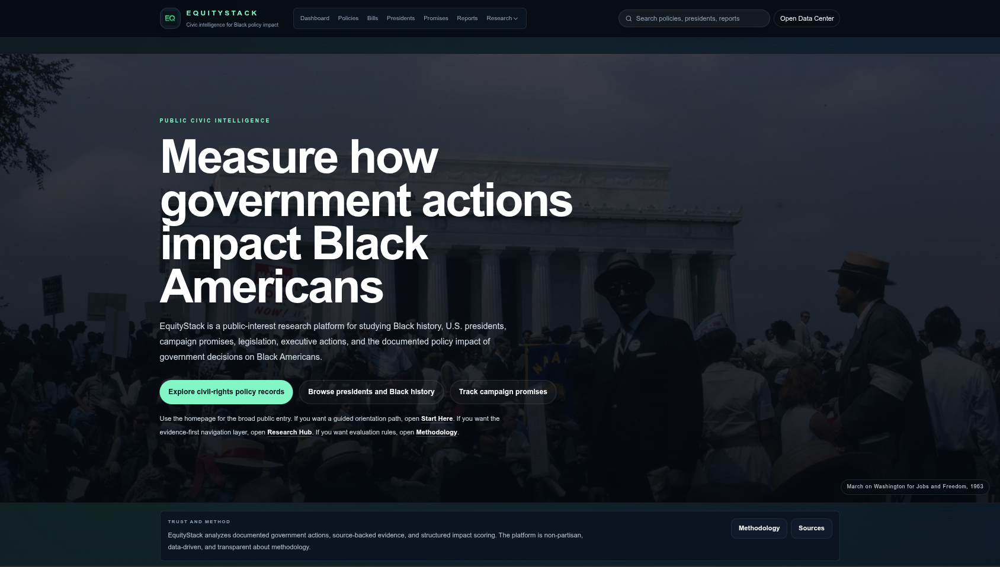
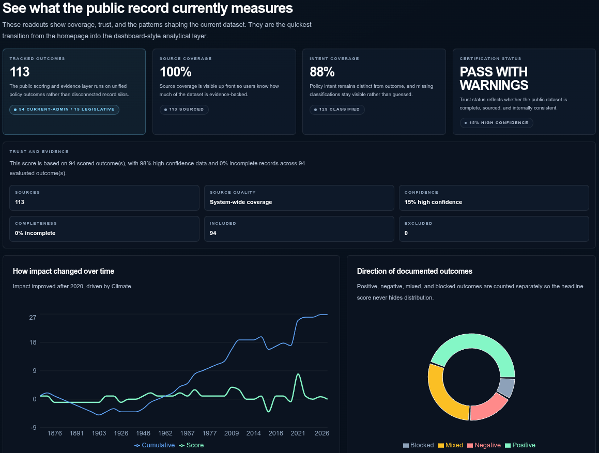
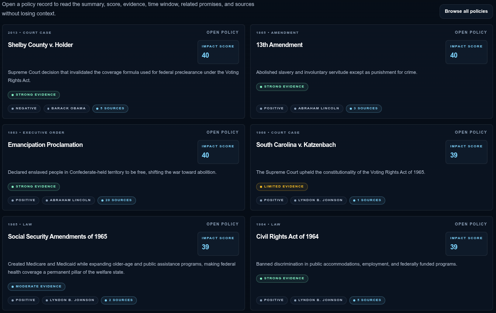

# EquityStack

**A public-interest civic data platform for tracking policy promises, presidential records, and measurable Black community impact.**

EquityStack helps users explore how policy decisions, campaign promises, legislation, and presidential actions connect to outcomes affecting Black Americans.

EquityStack exists to make civic accountability measurable, inspectable, and grounded in evidence instead of narratives.

🌐 **Live Site:** [https://equitystack.org](https://equitystack.org)

## Screenshots


*Track public claims, review evidence, and see how narratives are evaluated.*


*See how recurring narratives appear across multiple public figures.*


*Follow policies from promise to real-world outcomes.*


*Understand the historical and policy context behind each claim.*

## What EquityStack Does

EquityStack is designed to make civic accountability easier to understand by connecting:

- presidential promises
- public policy records
- legislative actions
- source-backed evidence
- Black Impact Score analysis
- promise fulfillment tracking
- historical and modern policy context

The goal is not to tell users what to think, but to make the public record easier to inspect.

## Key Features

- president-by-president policy and promise profiles
- Black Impact Score presentation and methodology
- Promise Tracker views for campaign commitment outcomes
- policy and legislation records with linked sources
- research hub, explainers, and public methodology pages
- narrative accountability pages for evaluating public claims
- searchable civic accountability data
- responsive public-facing UI built for readability

## Product Overview

EquityStack is built around connected public record pages rather than isolated summaries.

- President pages combine administration context, linked records, and public-facing score summaries.
- Promise pages connect public commitments to actions, status, and observable outcomes.
- Policy and legislation pages organize source-backed records so readers can compare impact, evidence, and historical context.
- Research, reports, and narrative accountability pages add context and help readers inspect claims through a consistent methodology.

## Why This Matters

Public policy discussions are often driven by narratives, not traceable data.

EquityStack connects promises, policy, and outcomes into a system that can be inspected, challenged, and improved over time.

## About This Repository

This repository contains the public website, public assets, and reader-facing research and methodology materials that support EquityStack.

Data is processed through structured workflows that are maintained separately from this public repository, and claims are evaluated using a consistent methodology reflected in the public product.

## Getting Started

```bash
git clone <repository-url>
cd equitystack-public
npm install
cp .env.example .env.local
npm run dev
```

Visit:

```text
http://localhost:3000
```

Useful commands:

```bash
npm run dev
npm run lint
npm run build
npm run start
```

## Contributing

Contributions, corrections, and source suggestions are welcome.

Helpful contributions include:

- fixing source links
- improving policy summaries
- adding missing historical context
- reporting data issues
- improving accessibility or UI clarity

## Data Note

This repository contains public-facing application code, public assets, and reader-facing research materials. It does not include private user data.

## License

EquityStack is released under the [MIT License](LICENSE).
